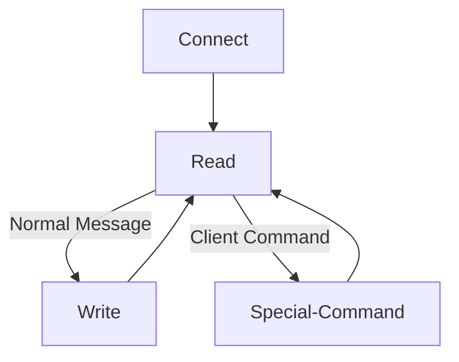

# KNN classifier
<em>"In statistics, the k-nearest neighbors algorithm (k-NN) is a non-parametric supervised learning method [...] k-NN is a type of classification where the function is only approximated locally and all computation is deferred until function evaluation"</em> [1]

This project is a demonstration of server and client sides, 
that provide tools for classification of groups of items with the k-NN classification algorithm. 

----
#### This project is written in <b>c++</b>, by <b>Michal Iakobashvili</b> and <b>Ohad Heines</b>

----

## Installation

This project relies on CMake to generate the executable file. If you don't have CMake yet, you can download it [here](https://cmake.org/download/), or alternatively, in a Debian-based system, run

```console
$ sudo apt install cmake
```

<p>Then, once cmake is installed, clone this project's repository with:</p>

```console
$ git clone 'https://github.com/bananabajanana/KNNClassifier3.0.git'
```

----

## Usage
The folder contains the source code of the server and client sides.
The client provides an example on how to interact with the server, 
and each folder contains a main file as an example of possible usage with
our code.

```
KNNClassifier3.0
│   ...
│
└───Client
│   │   ...
│   │   ClientMain.cpp
│
└───Server
│   │   ...
│   │   ServerMain.cpp
```

<p>You can run the project using our provided <code>CMakeLists.txt</code> file:</p>

```console
$ mkdir -p build && cd build
$ cmake ..
$ make -j && make Server && make Client
$ ./Server
```

After this, the compilation and linkage of the codes is complete and the Server is running.
All that is left is to run the Client program from a different terminal, as following:

```console
$ cd {path}/build
$ ./Client
```
Replacing {path} with the folder path to the project's repository on your personal computer.

----

## Implementation

### Server

Our server is constructed of four major divisions:
<details><summary>
<b>Classifier</b>
</summary>
<p> 

#### Manages the actual data and classification of objects with an implementation of the KNN algorithm.

We first save the objects themselves as Items, which each keep an item's characteristics and type.


```c++
class Item {
private:
    string type;
    const NPoint character;
    ...
};
```

The NPoint is a representation of the Item's parameters, and functions as a point in an N-dimensional coordinate system.

In addition, our code implements the algorithm with three different possible distance functions: Euclidean distance, Manhattan distance, and Chebyshev distance, but to allow the addition of other distance functions in the future, we implemented generic code with an abstract distance class.

```c++
class DistanceCalc {
public:
    virtual double distance(NPoint p1, NPoint p2) = 0;
    td::string toString();
    ...
};
```

Finally we created a Classifier class. An object of this type, keeps training and testing data (both with their corresponding type answers), and makes it's own classification. We keep the answers to both the test and answers, so we can later calculate the algorithm's confusion matrix. 

</p></details>

<details><summary>
<b>Commands</b>
</summary>
<p>

#### Manages the different commands sent by the client to the server. This includes things such as upload file, download file, classify data, and more.

To make the addition of new commands easy and accessible in the future, we made a generic Command abstract class, of which all commands inherit.

```c++
class Command {
    ...
    string description;
    virtual void execute() = 0;
};
```

Each command has to implement two major things in order to be added to the server. First it needs to implement an execute command, which does whatever the command is supposed to do. Second, it needs to keep a description of the command, in order to add it as a valid option in the menu for the client to pick. 

The current list of commands is as follows
* upload an unclassified csv data file - lets the client upload both a training data file and a testing data file.
* algorithm settings - lets the user view and change the k value and distance calculation method for the algorithm (accepted k values between 1 and 10, and valid calculation methods are "EUC" (Euclidean), "MAN" (Manhattan), "CHE" (Chebyshev)).
* classify data - asks the server to classify the data currently uploaded.
* display results - displays the results from the previous classification.
* download results - lets the user download the classification results from the previous classification to its computer.
* display algorithm confusion matrix - displays the algorithm's confusion matrix.
</p></details>

<details><summary>
<b>IOServices</b>
</summary>
<p>

#### Manages the two different approaches of getting I/O (Input / Output). The main one being socket I/O to allow server and client sides, but also implements console I/O to allow easy debugging.

To make it easier to add more I/O services in the future, we implemented an abstract DefaultIO Class as follows.

```c++
class DefaultIO {
    ...
    virtual string read() = 0;
    virtual void write(string toWrite) = 0;
};
```

This makes sure each I/O service implemented and used in the future implements at least the minimum requirements it needs to (an input and output commands).

The main way to get Input and Output in this project is through sockets (because we need to establish working communication between the server and clients). And so, we'll further explore the SocketIO class.

```c++
class SocketIO : public DefaultIO {
private:
    int socket;
    int expected_data_len = 4096;
    std::string toSend;
    ServerProcess server;
public:
    ...
};
```

The SocketIO saves the socket it is in charge of, and the ServerProcess which created it (ServerProcess objects are explained in `Server Code`).

In addition, while working on the server, we found out sometimes the server sends the client multiple different messages in a row, without needing an input in-between (which can cause a problem as the client doesn't know when to send input or listen to more content from the server).

To fix this problem, we made the SocketIO keep a buffer of everything it needs to send, and the `write` function just adds a message to this backlog.

```c++
void SocketIO::write(std::string message) {
    toSend += message;
}
```

Then, Only when we call the `read` command, we will send a message to the client.

```c++
std::string SocketIO::read() {
    //Sending backlog
    ...
    
    //Clearing backlog 
    toSend = "";
    
    //Reading new Message
    ...
}
```

This infrastructure makes sure we only send a message to the client when we expect an input, which makes the communication more consistent.

</p></details>

<details><summary>
<b>Server Code</b>
</summary>
<p>

#### These files manage the server processes. These are all about managing multiple clients, assigning sockets and threads, dealing with errors and making sure there are no memory leaks.

The server code is divided to two different object files. First manages the CLI (Command Line Interface) and communication with a single Client. And the second handles the management of sockets and threads for the server as a whole.

Thanks to all of our previous work, the CLI Object is relatively small and simple. It has one function `start`, which enters a continuous loop of printing the menu, waiting for a command decision, and executing the corresponding command.

```c++
class CLI {
    void start() {
        while(true) {
            //print menu based on all the commands' descriptions
            string menu = ...;
            defaultIO->write(menu);
            
            //receiving user choice
            string choice = defaultIO->read();
            switch (choice) {
                ...
            }
        }
    }
};
```

*Please note that this is merely a schematic representation of the algorithm, and there is more going on behind the scenes.*

The ServerProcess, manages multi-threading and socket assignment for new users. In addition, It manages the timeout mechanism and makes sure there are no memory leaks.

```mermaid
graph TD;
    Listen-->Accept;
    Accept.->CLI1-->Wait_For_Users;
    Accept.->CLI2-->Wait_For_Users;
    Accept.->CLI3-->Wait_For_Users;
    Listen-.timeout.->Wait_For_Users;
    Wait_For_Users-->Close_Server;
```

* `Listen`: The server waits for a user to connect.
* `Accept`: The accept stage in the connection process.
* `CLI`: A communication is created between the server and the client in a different thread.
* `Wait_For_Users`: Once the listen reached a timeout, it waits for the remaining users to finish their communication with the server.
* `Close_Server`: Frees remaining data from the heap.

</p></details>

### Server Parameters

* **Port = 6969** We chose this port number since it is not a commonly used port and is not part of the super-user port range (0-1024). [2]
* **Timeout = 15sec** Currently the Timeout is pretty small considering the server is supposed to wait for unrelated people to connect, but it is this way to demonstrate that timeout works without needing to wait exceptionally long each time.
* **Buffer Size = 4096** From various test cases and calculation known about the limitations of the input and output files, we concluded that this size is the minimum multiple of 2 that is big enough for our project. (It's mainly this big because of the buffer system as explaind in **IOServices** above)

It is important to mention that each of these variables are easily changeable in the [ServerProcess code](https://github.com/bananabajanana/KNNClassifier3.0/blob/4c8c2ba1275d9e308be0b3c4ba5c412ba2742d88/Server/ServerCode/ServerProcess.hpp#L19-L21)


----

### Client

The client is a sort of *simple demo* for interaction with the server. On activation, it connects to the server, and then sends each message from the server to the user and replies back the user's input. This is done in a continuous loop unless a special **Client Command** is sent from the server (i.e. uploading and downloading files) to the client. 



* `Connect`: The client connects to the server.
* `Read`: The client reads a message from the server.
* `Write`: If the message received was a normal message, it *passes it forward* to the user and replies to the server the user's response
* `Special Command`: If a message follows the syntax `\{command name} {command arguments}`, the server runs the corresponding command with it's given arguments. This includes mainly the Download and Upload commands, in which the client reads/writes to a file, and sends/receives the contents from the server, without concerning the user about it.

### !Client Remarks!

In our project, we were asked to implement the download command in a different thread, so we could download while asking other things from the server, but we didn't implement that.

This is because the download process involves both the server and the client (as the server doesn't have access to the client's files), 
which means a parallel execution as mentioned would need multi-threading on both the server and client, and opening another socket for 
file communication (aside from the main communication socket). This felt to us an enormous amount of work, considering the client was 
specified to not have multi-threading, and there was never a hint at needing multiple sockets for any single client. 

----
## Authors

* [Ohad Heines](https://github.com/bananabajanana)
* [Michal Iakobashvili](https://github.com/michaliakobashvili)

----
## Acknowledgements

For a better understanding of the algorithms, c++ language, and multiple dependencies, we used the following sites:
* [Wikiedia](https://www.wikipedia.org/)
* [Stack Overflow](https://stackoverflow.com/)
* [Linux Documentation](https://linux.die.net/)
* [Linux Manual](https://man7.org/linux/man-pages/man2/select.2.html)
* [GitHub Docs](https://docs.github.com/en)
* [Mermaid](https://mermaid-js.github.io/mermaid/#/)

[1]: https://en.wikipedia.org/wiki/K-nearest_neighbors_algorithm
[2]: https://en.wikipedia.org/wiki/69