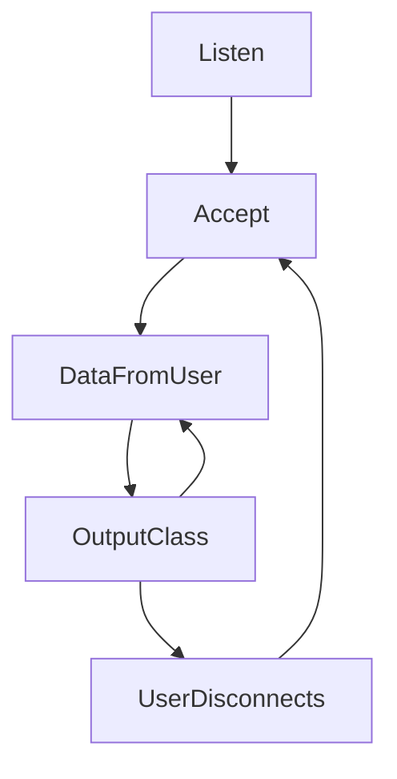
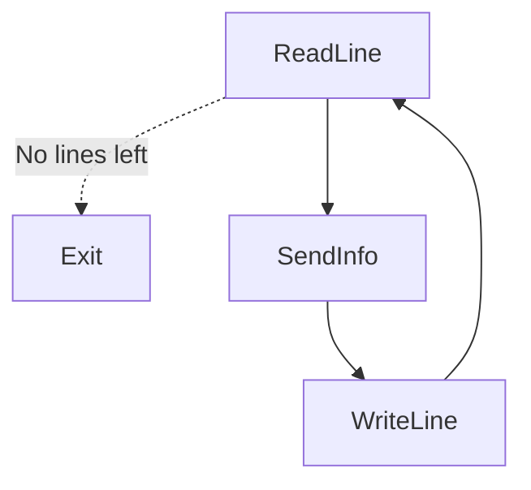

# KNN classifier
<em>"In statistics, the k-nearest neighbors algorithm (k-NN) is a non-parametric supervised learning method [...] k-NN is a type of classification where the function is only approximated locally and all computation is deferred until function evaluation"</em> [1]
<p>This project is an implementation of the kNN algorithm, to estimate the type of Iris flower based on four properties:</p>
<ul>
<li>Sepal length</li>
<li>Sepal width</li>
<li>Petal length</li>
<li>Petal width</li>
</ul>

----
#### This project is written in <b>c++</b>, by <b>Michal Iakobashvili</b> and <b>Ohad Heines</b>

----

## Installation

This project relies on CMake to generate the executable file. If you don't have CMake yet, you can download it [here](https://cmake.org/download/), or alternatively, in a Debian-based system, run

```console
$ sudo apt install cmake
```

<p>Then, once cmake is installed, clone this project's repository with:</p>

```console
$ git clone 'https://github.com/bananabajanana/KNNClassifier.git'
```

----

## Usage
You can run the code with our default input files, or alternatively put in your own.
The server has it's training data in <code>TrainingData.csv</code>.
In addition the client's input and output files can be given as arguments during compilation time, but it is recommended to put them as <code>Unclassified.csv</code> and <code>Classified.csv</code> folders as shown below.

```
KNNClassifier
│   ...
│
└───Client
│   │   ...
│   │   
│   └───Data
│   │   │   Unclassified.csv
│   │       
│   └───Output
│       │   Classified.csv
│
└───Server
│   │   ...
│   │   
│   └───Data
│   │   │   TrainingData.csv
```

<p>You can run the project using our provided <code>CMakeLists.txt</code> file:</p>

```console
$ mkdir -p build && cd build
$ cmake ..
$ make -j && make Server && make Client {IPath} {OPath}
$ ./Server
```
Where {IPath} should be replaced with the path to the input file to be trainingData, and {OPath} with the path to output the data to.
It is also possible to keep not specify {IPath} and {OPath} arguments, which will cause the program to work with the default arguments specified above.

After this, the compilation and linkage of the codes is complete and the Server is running.
All that is left is to run the Client program from a different terminal, as following:

```console
$ cd {path}/build
$ ./Client
```
Replacing {path} with the folder path to the project's repository on your personal computer.

----

## Implementation

### Server
We first created a Flower object, that will store a single flower's type and parameters. The flower's type is stored as an enum, with four options: the three possible types, and an undefined option.

```c++
enum typeIris { versicolor, virginica, setosa, undifined };

class Flower {
private:
    typeIris type;
    const NPoint character;
    ...
};
```
The NPoint is a representation of the Flower's parameters, and functions as a point in an N-dimensional coordinate system (in 4d with the current implementation example, but can easily be expanded).

Our code implements the algorithm with three different possible distance functions: Euclidean distance, Manhattan distance, and Chebyshev distance, but to allow the addition of other distance functions, we implemented generic code with an abstract distance class.

```c++
class DistanceCalc {
public:
    virtual double distance(NPoint p1, NPoint p2) = 0;
    ...
};
```

In addition, to keep track of all our different types of distances implemented, we made a DistancesData builder class.

```c++
class DistancesData {
    /**
     * @return all the types of distance calculators that can be used.
     */
    static std::vector<DistanceCalc*>& getAllTypes();
};
```

Finally, we created a Classifier class. This class identifies a given vector of flowers based on an input list of already identified Irises. This is implemented step-by-step according to the kNN algorithm, first finding the k closest neighbors to the unidentifiable flower, and then finding which category is most common among them.

With these implemented, the server runs indefinitely in the following loop:



* <code>Listen</code>: The server waits for a user to connect.
* <code>Accept</code>: The accept stage in the connection process.
* <code>DataFromUser</code>: The server receives information about an unclassified flower from the user.
* <code>OutputClass</code>: The server sends to the user the classification of the flower.
* <code>UserDisconnects</code>: The current user disconnects, allowing the server to interact with a new user.

All the transitions are managed by a middle step we'll call <code>Select</code>. The <code>Select</code> is in charge of managing the following things:
1. Gracefully closing the server in case of internal errors.
2. Managing timeouts: if there is a non-active client - kick it, and in any case keep listening for further actions.
3. If there are no connected clients, a client must be connecting, and we'll accept it.
4. If there is an active client, we'll communicate with it through the server protocol.

### Server Parameters

* **Port = 6969** We chose this port number since it is not a commonly used port and is not part of the super-user port range (0-1024). [2]
* **Timeout = 5sec** We gave clients a generous amount of time before kicking them out.
* **Buffer Size = 1024** Since the user can only send one flower info at a time, we limited the user's message size to 128 bytes.

### Client

The client is a sort of *simple demo* for interaction with the server. It takes an input file from the user, and sends the flower information - one by one - to the server, while outputting the given classifications to an output file.



* <code>ReadLine</code>: The client program reads a line from the input file.
* <code>SendInfo</code>: The client sends the flower info previously read to the server.
* <code>WriteLine</code>: The client writes the given class to the output file.
* <code>Exit</code>: If there are no lines left, the client closes its connection with the server.

----
## Authors

* [Ohad Heines](https://github.com/bananabajanana)
* [Michal Iakobashvili](https://github.com/michaliakobashvili)

----
## Acknowledgements

For a better understanding of the algorithms, c++ language, and multiple dependencies, we used the following sites:
* [Wikiedia](https://www.wikipedia.org/)
* [Stack Overflow](https://stackoverflow.com/)
* [Linux Documentation](https://linux.die.net/)
* [Linux Manual](https://man7.org/linux/man-pages/man2/select.2.html)
* [Mermaid](https://mermaid-js.github.io/mermaid/#/)

[1]: https://en.wikipedia.org/wiki/K-nearest_neighbors_algorithm
[2]: https://en.wikipedia.org/wiki/69